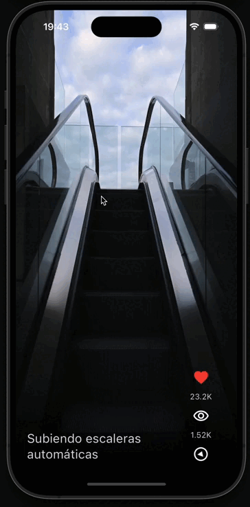

# Flutter Udemy's Course

This is a place to share my progress throughout this course

Current progress:

- yes_no_app
  

- toktik
  

- WidgetsApp
	- Riverpod
	- Material UI widgets
	- Clean Architecture oriented
  

- Cinemapedia
	- Riverpod	
	- Clean Architecture oriented
 
 
